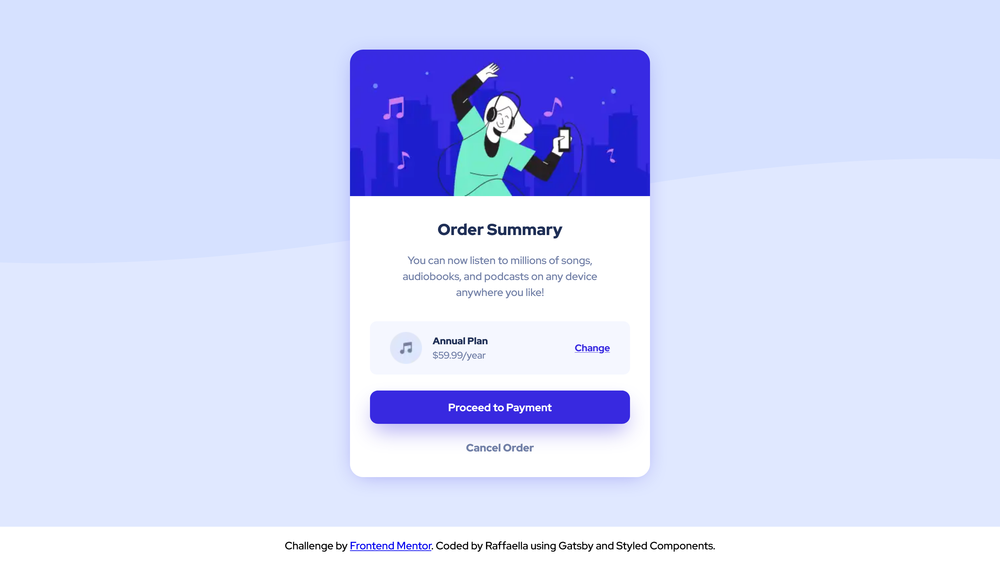

# Frontend Mentor - Order summary card solution

This is a solution to the [Order summary card challenge on Frontend Mentor](https://www.frontendmentor.io/challenges/order-summary-component-QlPmajDUj). Frontend Mentor challenges help you improve your coding skills by building realistic projects. 

## Table of contents

- [Overview](#overview)
  - [The challenge](#the-challenge)
  - [Screenshot](#screenshot)
  - [Links](#links)
- [My process](#my-process)
  - [Built with](#built-with)
  - [What I learned](#what-i-learned)
  - [Useful resources](#useful-resources)
- [Author](#author)


## Overview

### The challenge

Users should be able to:

- See hover states for interactive elements

### Screenshot



### Links

- Solution URL: [github repo](https://github.com/raffaellavinzio/order-summary-component)
- Live Site URL: [git pages](https://raffaellavinzio.github.io/order-summary-component/)

## My process

### Built with

- Semantic HTML5 markup
- CSS custom properties
- Flexbox
- Mobile-first workflow
- [React](https://reactjs.org/) - JS library
- [Gatsby](https://gatsbyjs.org/) - React framework
- [Styled Components](https://styled-components.com/) - For styles

### What I learned

I learned how to use local web fonts and background images with styled components by importing the media files.

To see how you can add code snippets, see below:


```js
import ImgBgMobile from '../../images/pattern-background-mobile.svg'

const Main = styled.main`
  background: var(--color-primary-pale-blue) url(${ImgBgMobile}) no-repeat;
  `
}
```

### Useful resources

- [CSS for JavaScript Developers](https://css-for-js.dev/) - This awesome course helped me get started with styled components and CSS custom properties. 


## Author

- Frontend Mentor - [@raffaellavinzio](https://www.frontendmentor.io/profile/raffaellavinzio)


